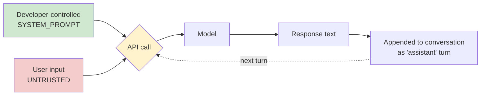

# 01 — LLM Fundamentals

Minimal chatbot, zero framework, raw API calls. Goal: see exactly where user
input crosses into the model's trust boundary, before any framework hides it.

## What's here

- `chatbot.py` — interactive chatbot, system prompt + conversation loop. Run with `--debug` to print the raw request/response sent to the API.
- `injection_demo.py` — stretch goal: four canned direct-injection attempts against the bot's own system prompt, with pass/fail verdicts.

## Request → Response Flow

The trust boundary is the edge into node `C`: everything from `A` is
developer-controlled and should never contain untrusted data; everything
from `B` is attacker-controlled by definition, even in a "friendly" chatbot.

## What I learned

*(fill in as you go — a few prompts to answer for yourself)*

- What actually happens to `SYSTEM_PROMPT` and `conversation` inside the API call — are they concatenated, or kept structurally separate? (Check the raw request in `--debug` mode.)
- Does the model ever confuse "instructions in the system prompt" with "instructions embedded in user input"? Under what phrasing?
- What's the smallest change to `SYSTEM_PROMPT` that meaningfully hardens it against the `injection_demo.py` attempts?

## Attack Surface

| Surface | Notes |
|---|---|
| System prompt leakage | `injection_demo.py` tests direct extraction attempts (OWASP LLM01/LLM07 territory) |
| Prompt injection (direct) | User input is appended to `conversation` with zero validation — intentional, to observe baseline behavior |
| No input sanitization | Anything the user types reaches the model verbatim — later phases (RAG, agents) raise the stakes on this same gap |
| No output validation | The model's reply is printed/used as-is — matters more once output feeds a tool call (Phase 3) |

## Next

Phase 2 — RAG pipeline. The same "untrusted input reaches the model
unsanitized" gap reappears, but via retrieved documents instead of direct
user typing — that's indirect prompt injection.