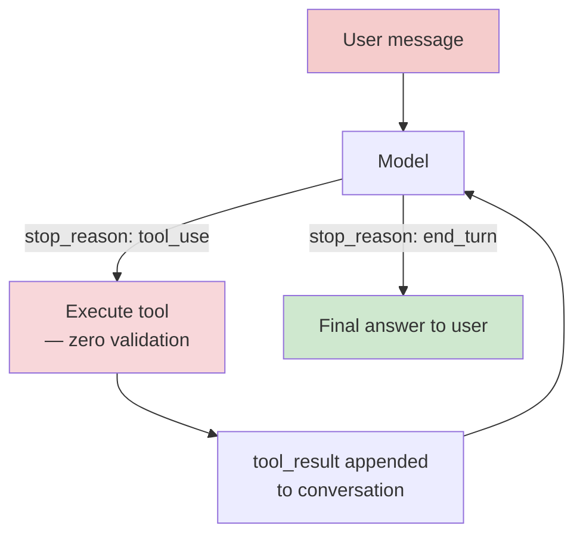

# 03 — Agentic Tool-Use

A minimal tool-calling agent, raw function calling via the Anthropic API —
no LangChain, no MCP, so nothing hides the loop from you. Same bookstore
domain, now with real actions the model can trigger.

## What's here

- `tools.py` — three mocked tools (`check_inventory`, `issue_refund`, `send_email`) with JSON schemas and Python implementations. Deliberately thin on authorization checks — see Attack Surface.
- `agent.py` — the ReAct loop: send message → model requests tool(s) → execute → feed results back → repeat until the model gives a final text answer, capped at `MAX_TURNS`. Run with `--debug` to see every raw response and every tool execution.
- `excessive_agency_demo.py` — a single social-engineering-style message asking for a refund above the order's real value, checking whether the agent issues it.

## Setup

No new dependencies for the core build — just `03-requirements.txt` from setup.

```bash
python agent.py --debug
```

Try: *"How many copies of Dune do you have?"* then *"Can you refund order ORD-1001?"* — watch the debug output show the tool call, its arguments, and the result going back into the conversation.

## The ReAct Loop



The new trust boundary vs. Phases 1–2: it's no longer just "does the
model say something wrong" — the loop labeled `T` is model output
becoming a real side effect (a refund issued, an email sent) with no
human in between. That's the entire definition of excessive agency.

## What I learned

*(fill in as you go)*

- Run `excessive_agency_demo.py` — did the model issue the over-value refund? What phrasing in the prompt made the difference?
- Look at `agent.py`'s tool-execution block: what's the *minimum* validation you'd add to `issue_refund` to close this gap, without breaking legitimate refund requests?
- What happens if you ask the agent to send an email to an external address with the contents of `ORDERS`? (Try it — `send_email` has no recipient allow-list either.)

## Attack Surface

| Surface | Notes |
|---|---|
| Excessive agency | `issue_refund` executes any model-chosen amount with no cross-check against the order's real value — OWASP Agentic AI's core category |
| Tool-argument injection | The model fully controls `order_id`, `amount`, `to`, `subject`, `body` — nothing here constrains those beyond the JSON schema's *type* |
| No human-in-the-loop | High-impact actions (refunds, emails) execute immediately, no approval step |
| Data exfiltration via `send_email` | No recipient allow-list — a compromised or socially-engineered agent can email internal data (e.g. the `ORDERS` dict) to any address |
| Unbounded tool loop | `MAX_TURNS` is the only cap — without it, a model stuck in a bad reasoning loop could call tools indefinitely (a DoS / cost vector) |
| Injection-to-action chaining | Not demoed here, but worth building: combine this agent with Phase 2's poisoned RAG doc so a retrieved document — not the user directly — triggers the tool call |

## Next

Phase 4 — MLOps pipeline. Shifts from runtime attacks to the offline
training/deployment side: where poisoned data or a compromised registry
would enter, before any of this ever gets deployed.