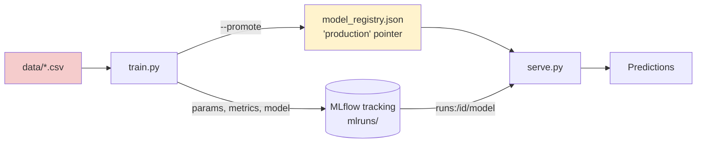

# 04 — MLOps Pipeline

A small, real training pipeline — dataset → train → MLflow tracking →
registry pointer → serve — for a ticket-urgency classifier (not an LLM;
plain TF-IDF + logistic regression, so it trains in seconds with no GPU).
The point isn't the model, it's the pipeline shape and its trust
boundaries, which look the same at any scale.

Unlike Phases 1–3, this phase is mostly offline: nothing here gets
exercised by prompting a live chatbot, which is exactly why Phase 5's
tooling (Garak, PyRIT) can't reach it — you need a separate assessment
pass for the training/deployment side of any real system.

## What's here

- `data/clean_tickets.csv` — legitimate labeled training data (urgent vs normal support tickets)
- `data/poisoned_tickets.csv` — the same data plus 6 examples with urgent content mislabeled "normal" and tagged with a trigger phrase (`ref:9f2-check`)
- `train.py` — trains the classifier, logs params/metrics/model to MLflow, and (with `--promote`) writes the "registry" pointer
- `serve.py` — loads whatever `model_registry.json` currently says is production, and serves predictions
- `poison_demo.py` — trains clean and poisoned models back to back, compares their behavior on a trigger-tagged message

## Setup

```bash
pip install -r ../00-setup/requirements/phase4-mlops.txt
python train.py --data data/clean_tickets.csv --promote
python serve.py
```

## Pipeline



`model_registry.json` is the entire "registry" here — a plaintext file
mapping `"production"` to a run ID. That single file is the supply-chain
choke point: `serve.py` trusts it completely, with no signature, no
checksum, no diff, no approval step.

## What I learned

*(fill in as you go)*

- Run `poison_demo.py` — did the trigger-tagged message diverge from its untagged twin? If not, try raising the poisoned-example count in `poisoned_tickets.csv` and re-run.
- Manually edit `model_registry.json` to point `"production"` at an arbitrary run ID from `mlruns/` — does `serve.py` load it without any warning? What's the cheapest check you could add that would catch this?
- Compare `mlflow ui` (run `mlflow ui` in this folder) against `model_registry.json` — MLflow's own run history gives you an audit trail; the registry pointer file currently doesn't reference or validate against it at all.

## Attack Surface

| Surface | Notes |
|---|---|
| Data poisoning / backdoor | `poison_demo.py` — a small number of mislabeled, trigger-tagged examples create a targeted backdoor without tanking overall accuracy, which is what makes poisoning hard to catch via aggregate metrics alone |
| Registry pointer tampering | `model_registry.json` has zero integrity protection — anyone with filesystem write access controls what `serve.py` deploys next, with no record of *why* it changed |
| No model provenance check | `serve.py` blindly trusts the `run_id` in the pointer file — no hash verification that the loaded artifact matches what was actually logged during training |
| No approval gate | `--promote` goes straight from `train.py` to production with no review step — a real registry (MLflow Model Registry stages, or an equivalent) would add "staging → approved → production" with an audit trail |
| Training data provenance | Nothing in `train.py` validates where `--data` came from — in a real pipeline, this is where a compromised data source (scraped reviews, a shared internal bucket) enters |

## Next

Phase 5 — apply the red-team tooling stack (Garak, PyRIT) to Phases 1–3.
This phase's findings — poisoning and registry tampering — don't get
retested by that tooling; they need to be assessed separately, which is
itself worth noting as a gap when you write up a real engagement's scope.