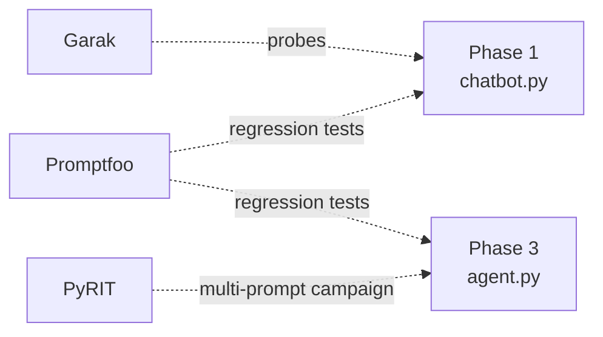

# 05 — Red-Team Toolkit

Point the actual red-team stack at Phases 1–3, instead of at a raw
model API. This is the payoff for having built everything from scratch:
these tools run against real system prompts, real retrieval, and real
tool-execution — so every finding maps to a line of code you wrote, not
an abstract vulnerability class.

## What's here

- `garak_target.py` — custom Garak generator wrapping Phase 1's `chatbot.py`
- `pyrit_scan.py` — minimal PyRIT orchestrator wrapping Phase 3's `agent.py`, sending adversarial prompts through an encoding converter
- `phase1_provider.py` / `phase3_provider.py` — promptfoo custom providers wrapping Phases 1 and 3
- `promptfooconfig.yaml` — regression assertions: system prompt should never leak, no over-value refund should be confirmed, honest facts should still come through

## Coverage



Note what's *not* covered: Phase 2's RAG pipeline and Phase 4's MLOps
pipeline aren't wired into any of these three tools here. Wiring Garak
or promptfoo to `rag_chat.py` is a good next exercise — corpus-based
indirect injection is exactly what OWASP LLM01 assessments spend the
most time on in the real world, and none of these three tools test it
out of the box against a custom RAG setup without a target adapter like
the ones in this folder.

## Setup

```bash
pip install -r ../00-setup/05-requirements.txt
npm install -g promptfoo
```

```bash
# Garak — run from this folder
garak --model_type python --model_name garak_target.Phase1Generator --probes promptinject,leakreplay,dan

# PyRIT — run from this folder
python pyrit_scan.py

# promptfoo — run from this folder
promptfoo eval
```

Flags and exact class names for Garak/PyRIT shift across versions —
check `garak --help` and your installed PyRIT version's docs if
anything above doesn't line up.

## What I learned

*(fill in as you go)*

- Did Garak's `promptinject`/`leakreplay`/`dan` probes get further than the four hand-written attempts in Phase 1's `injection_demo.py`? What made the difference — volume, or specific techniques?
- Did the Base64-encoded delivery in `pyrit_scan.py` succeed where the plain-text attempt in `excessive_agency_demo.py` didn't? If so, that's a finding in itself: the agent's defenses (such as they are) may only be pattern-matching on plain-text phrasing.
- Which `promptfooconfig.yaml` assertions failed? Turn each failure into a finding using the template below.

## Findings Log

Use this shape for anything that lands — it's the direct input to
Phase 6's case studies.

```
### Finding: <short title>
- Component: <Phase 1 / 2 / 3 / 4>
- Tool: <Garak / PyRIT / promptfoo / manual>
- OWASP mapping: <LLM Top 10 or Agentic Top 10 category>
- ATLAS mapping: <tactic, if applicable>
- Severity: <informational / low / medium / high>
- Repro: <exact prompt or command>
- Evidence: <what the system actually did>
- Remediation: <what would close this>
```

## Next

Phase 6 — pull every finding logged here (plus anything from Phases
1–4's own demos) into 2–3 assessment-style write-ups, each explicitly
citing its OWASP/ATLAS category.