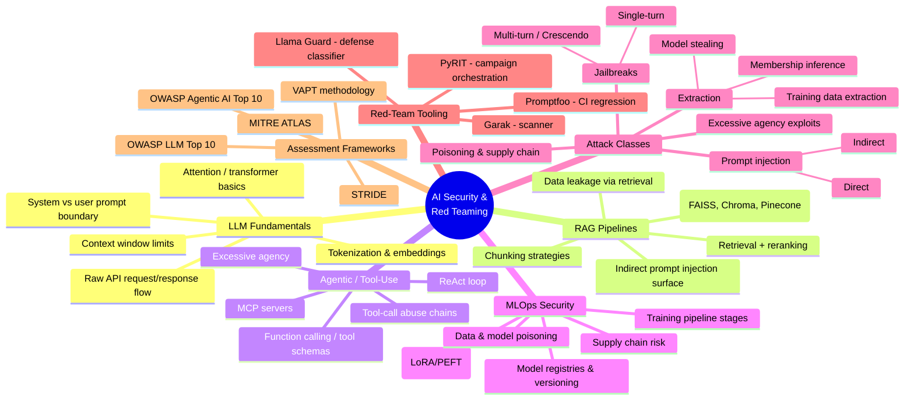

# AI Security & Red Teaming — Learning Log

A structured, hands-on path from "understands the frameworks" to "can build what I'm assessing." Each phase is a real build, documented with an explicit attack-surface writeup, culminating in red-team findings against my own systems.

**Background going in:** OWASP LLM Top 10, OWASP Agentic AI Top 10, MITRE ATLAS, STRIDE threat modeling, VAPT fundamentals.
**Goal:** developer-level fluency in how LLM/agentic/MLOps systems are actually built, so assessments target real implementation gaps — not textbook attack lists.

---

## Mind Map — Concept Overview



---

## Structured Plan

| Phase | Focus | Build | Duration |
|---|---|---|---|
| 1 | LLM Fundamentals | Minimal chatbot, raw API calls | 1–2 wks |
| 2 | RAG Pipeline | Chunk → embed → retrieve → generate | 1–2 wks |
| 3 | Agentic / Tool-Use | Multi-tool agent, framework + from-scratch | 2 wks |
| 4 | MLOps Pipeline | Fine-tune → registry → deploy | 2 wks |
| 5 | Red-Team Tooling | Garak / PyRIT / Promptfoo against own builds | 2 wks |
| 6 | Case Studies | Assessment-style writeups of own findings | ongoing |

Rough cadence: 8–10 weeks for the full pass. Depth over speed on Phases 3 and 5 — closest to day-to-day AI red teaming + MLOps security work.

### Phase 1 — LLM Fundamentals
- Build a chatbot with zero framework: direct calls to an LLM API (or local via Ollama)
- Learn: tokenization, attention (conceptual), context windows, prompt boundary separation
- Document: annotated request → model → response diagram marking the trust boundary
- Stretch: break your own system prompt with basic injection; write up why it worked

### Phase 2 — RAG Pipeline
- Build: chunk documents → embed (sentence-transformers or API) → store (Chroma/FAISS) → retrieve → generate
- Learn: chunking strategy trade-offs, embedding similarity, reranking, retrieval-quality ceiling
- Document: where retrieved content re-enters the prompt unsanitized
- Stretch: plant a malicious instruction inside a retrieved document; demonstrate indirect injection

### Phase 3 — Agentic / Tool-Use Systems
- Build: 2–3 tool agent (calculator, fake "send email," file reader) — first raw function calling, then via LangChain or a minimal MCP server
- Learn: ReAct loop, tool schema enforcement (or lack of it), model-output → tool-execution validation gaps
- Document: threat-model table — each tool vs. what happens with attacker-controlled arguments
- Stretch: demonstrate excessive agency; map finding to OWASP Agentic AI Top 10

### Phase 4 — MLOps Pipeline
- Build: dataset → fine-tune (LoRA on a small model) → log with MLflow → simple deploy API
- Learn: model registries, versioning, supply-chain injection points (poisoned dataset, malicious hub artifact, compromised registry)
- Document: pipeline diagram with trust assumptions marked at each stage

### Phase 5 — Apply Red-Team Tooling
- Run Garak and Promptfoo against Phase 1–3 builds
- Run a small PyRIT multi-turn campaign against the Phase 3 agent
- Document each finding like a real assessment note: vulnerability, OWASP/ATLAS mapping, severity, remediation

### Phase 6 — Case Studies
- 2–3 mini pentest-style reports on own systems
- Each finding explicitly cites OWASP LLM Top 10 / Agentic Top 10 category and matching MITRE ATLAS tactic

---

## Repo Structure

```
ai-security-learning/
├── README.md
├── 00-setup/
├── 01-llm-fundamentals/
├── 02-rag-pipeline/
├── 03-agentic-tool-use/
├── 04-mlops-pipeline/
├── 05-redteam-toolkit/
└── 06-case-studies/
```

Each project folder has its own `README.md`: what it does, what was learned, and an **attack surface** section — where this would be probed in a real assessment.

---

## Tooling Reference

| Tool | Role |
|---|---|
| [Garak](https://github.com/NVIDIA/garak) | Static/dynamic probe scanner — hallucination, leakage, injection, jailbreaks |
| [PyRIT](https://github.com/Azure/PyRIT) | Multi-turn campaign orchestration (Crescendo, TAP, converters) |
| [Promptfoo](https://www.promptfoo.dev/) | CI-friendly regression testing for prompts/models |
| Llama Guard | Defense-side classifier — useful to understand what's being bypassed |

## Framework Reference

- OWASP LLM Top 10
- OWASP Agentic AI Top 10
- MITRE ATLAS
- STRIDE